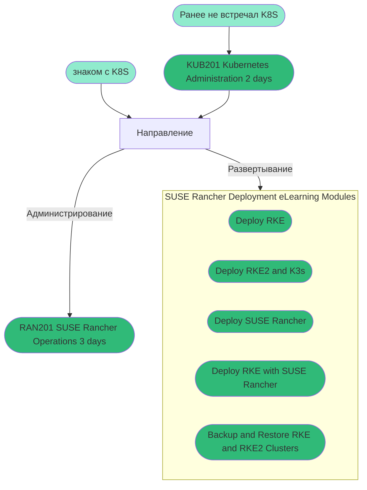

# Информацмия о текущих курсах SUSE Rancher

```mermaid
flowchart TB
style id10 fill:#90EBCD
style id11 fill:#90EBCD
style id1 fill:#30BA78
style id2 fill:#30BA78
style id3 fill:#30BA78
style id4 fill:#30BA78
style id5 fill:#30BA78
style id6 fill:#30BA78
style id7 fill:#30BA78


  id10([Ранее не встречал K8S]) --> id1([KUB201 Kubernetes Administration 2 days])
  id11([знаком с K8S]) --> id20[Направление]
  id1 --> id20
  id20 --> |Администрирование| id2([RAN201 SUSE Rancher Operations 3 days])
  id20 --> |Развертывание| d30
  subgraph d30 [SUSE Rancher Deployment eLearning Modules]
    id3([Deploy RKE])
    id4([Deploy RKE2 and K3s])
    id5([Deploy SUSE Rancher])
    id6([Deploy RKE with SUSE Rancher])
    id7([Backup and Restore RKE and RKE2 Clusters])
  end
```
