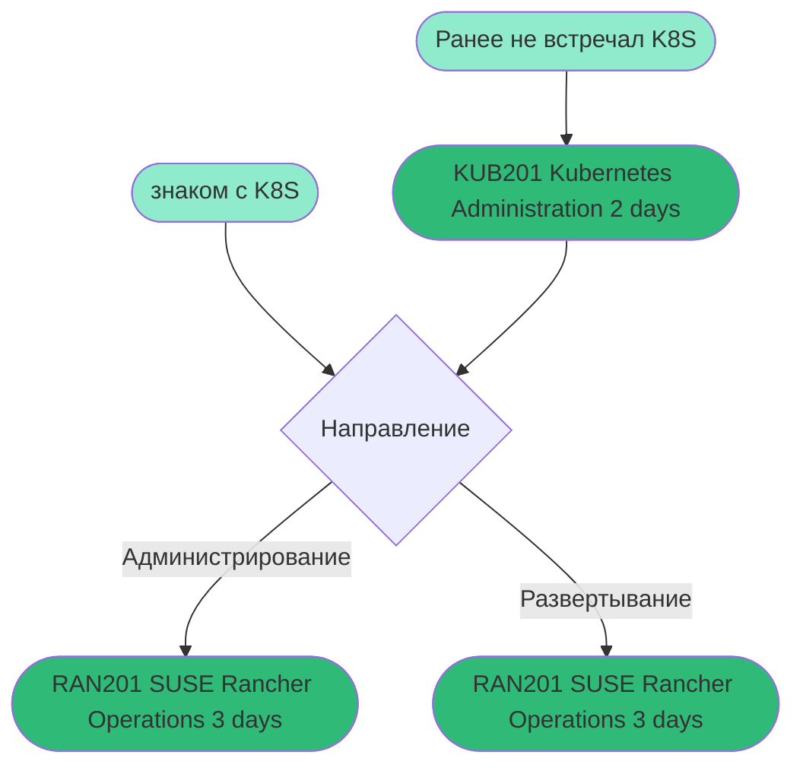

```mermaid
flowchart TB
style id10 fill:#90EBCD
style id11 fill:#90EBCD
style id1 fill:#30BA78
style id2 fill:#30BA78
style id3 fill:#30BA78

  id10([Ранее не встречал K8S]) --> id1([KUB201 Kubernetes Administration 2 days])
  id11([знаком с K8S]) --> id20{Направление}
  id1 --> id20
  id20 --> |Администрирование| id2([RAN201 SUSE Rancher Operations 3 days])
  id20 --> |Развертывание| id3([RAN201 SUSE Rancher Operations 3 days])
```
