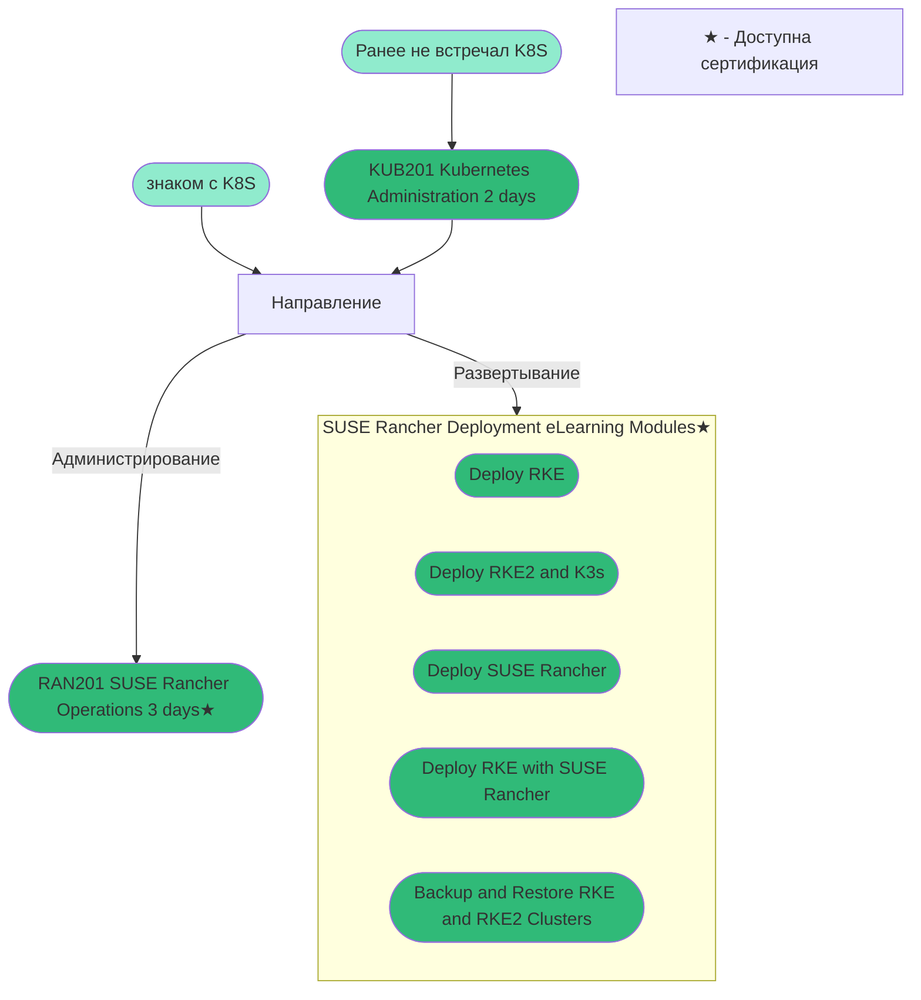

# Информация о текущих курсах по линейке SUSE Rancher
В настоящий момент существует два варианта прохождения обучения:
* [Платные курсы предоставляемые компанией SUSE](https://www.suse.com/training/course/)
* [Курсы предоставляемые сообществом](https://community.suse.com/all-courses)

Доступные курсы предоставляемые компанией SUSE покрывают все продукты компании (исключения, продукты только что появившиеся в портфолио, для которых доступны только внутренние курсы компании)

Ниже рассмотрим курсы доступные по продукту SUSE Rancher, и возможности по сертификации.

Дорожная карта обучения от компании SUSE по обучению SUSE Rancher:

Если говорить о сертификации SCA in SUSE Rancher 2.6, то от компании SUSE доступен курс [RAN201 SUSE Rancher Operations](https://www.suse.com/training/course/ran201v2.6) предназначенный для подготовки к этому экзамену, [курс](https://community.suse.com/courses/5804003/content) от сообщества более общий он включает в себя так-же части из курсов по развертыванию RKE, однако в нем пропущены некоторые части, к которым подготовится придется самостоятельно.

Если пользоваться курсами от сообщества, то перед экзаменом, настоятельно рекомендуется просмотреть список тем курса от компании SUSE и подтянуть, те темы, в которых есть пробелы.
